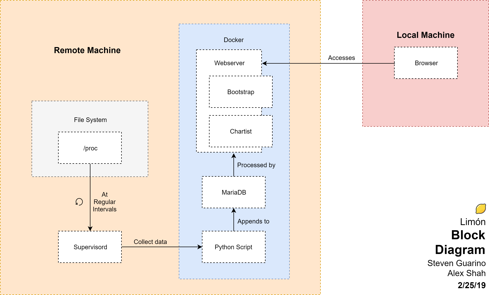

# Limón : Linux Monitor
## Alex Shah & Steven Guarino
### MSCS 710 Spring 2019

## Requirements:
Ubuntu LTS (18.04+)

Docker (17+)

docker-compose (1.13+)

## Installation
0. Clone the repository on the machine you want to monitor:

`git clone https://github.com/AlexKShah/MSCS710.git; cd MSCS710;`

1. Install dependencies:

`sudo apt update && sudo apt install -y docker docker-compose`

2. Build

`sudo docker-compose up --build`

3. Monitor

Navigate to `machineIP:5000` in a browser
